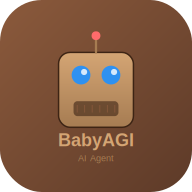

# 👶 BabyAGI II - State-of-the-Art Autonomous AI Agent



BabyAGI II is a cutting-edge Progressive Web Application (PWA) featuring an autonomous AI agent framework for intelligent task planning, reasoning, and execution. Built with modern web technologies and a beautiful skeuomorphic design.

## ✨ Key Features

### 🤖 Advanced AI Capabilities
- **OpenRouter API Integration**: Access to multiple free AI models including:
  - Meta Llama 3.2 (1B & 3B Instruct)
  - Google Gemma 2 9B
  - Microsoft Phi-3 Mini 128K
  - Mistral 7B Instruct
  - Hermes 3 Llama 3.1 405B
  - Qwen 2 7B Instruct
- **Autonomous Task Management**: Automatic task generation, prioritization, and execution
- **Contextual Learning**: Agent learns from completed tasks to improve future performance
- **Real-time Task Tracking**: Monitor agent progress with live updates

### 📱 PWA Features
- **Install as Native App**: Add to home screen on mobile and desktop
- **Offline Support**: Service worker caching for offline functionality
- **App-like Experience**: Standalone display mode without browser chrome
- **Custom Icons & Splash Screen**: Professional branding across all platforms
- **Responsive Design**: Works seamlessly on all device sizes

### 🎨 Skeuomorphic UI Design
- **Realistic Textures**: Leather and wood grain backgrounds
- **Beveled Edges**: 3D-like buttons and panels with depth
- **Rich Gradients**: Warm, earthy color palette (#8b5a3c, #d4a574, #2d2013)
- **Tactile Controls**: Buttons that feel like physical objects
- **Material Mimicry**: UI elements that resemble real-world materials
- **Subtle Shadows**: Depth and dimension throughout the interface

### 💾 State Management
- **Save & Load**: Preserve agent state between sessions
- **Task History**: Complete record of all completed tasks
- **Export Reports**: Generate PDF reports of agent activities

## 🚀 Getting Started

### Prerequisites
- Node.js 16+ installed
- OpenRouter API key (free tier available)

### Installation

1. **Clone the repository**
   ```bash
   git clone https://github.com/d64483912-cmd/BbyAGI.git
   cd BbyAGI
   ```

2. **Install dependencies**
   ```bash
   npm install
   ```

3. **Run the development server**
   ```bash
   npm run dev
   ```

4. **Open your browser**
   Navigate to `http://localhost:3000`

### Setting Up OpenRouter API

1. **Get a free API key**
   - Visit [OpenRouter](https://openrouter.ai/keys)
   - Sign up for a free account
   - Generate your API key

2. **Configure in the app**
   - Click the ⚙️ Settings button in the top right
   - Paste your API key
   - Select your preferred AI model
   - Click "Validate & Save"

## 📖 How to Use

### Basic Workflow

1. **Set Your Objective**
   - Enter a clear, specific goal in the objective input
   - Example: "Create a marketing strategy for a new mobile app"

2. **Start the Agent**
   - Click the ▶️ Start Agent button
   - The agent will generate initial tasks automatically

3. **Monitor Progress**
   - Watch as the agent executes tasks in real-time
   - View current task, pending tasks, and completed history
   - Agent will automatically prioritize and generate new tasks

4. **Control Execution**
   - ⏸️ **Pause**: Temporarily stop the agent
   - ▶️ **Resume**: Continue from where you left off
   - 🔄 **Reset**: Clear everything and start fresh
   - ⏭️ **Skip Task**: Move to the next task
   - 🗑️ **Clear All**: Remove all tasks

5. **Save Your Work**
   - 💾 **Save State**: Store current progress to localStorage
   - 📂 **Load State**: Restore a previously saved session
   - 📊 **Export PDF**: Generate a professional report

### Advanced Features

#### Execution Interval
Control the speed of task execution:
- Set to `0` for instant progression
- Set to `5` for 5 seconds between tasks (default)
- Adjust based on API rate limits and observation needs

#### Task History
- Filter completed tasks by keyword
- Review detailed results of each task
- Track timestamps and execution order

#### Model Selection
Choose the best model for your needs:
- **Fast models** (1B-3B): Quick responses, good for simple tasks
- **Balanced models** (7B-9B): Good quality and speed
- **Powerful models** (405B): Best quality (limited availability)

## 🏗️ Architecture

### Tech Stack
- **Frontend**: React 19, TypeScript
- **Build Tool**: Vite 6.2
- **PWA**: vite-plugin-pwa with Workbox
- **API**: OpenRouter (replacing Google Gemini)
- **PDF Export**: html2canvas + jsPDF
- **Styling**: Custom skeuomorphic CSS + Tailwind CSS

### Project Structure
```
BbyAGI/
├── components/           # React components
│   ├── AgentControl.tsx  # Pause/Resume/Reset controls
│   ├── AgentOutput.tsx   # Output and task history display
│   ├── ExecutionIntervalInput.tsx
│   ├── ObjectiveInput.tsx
│   ├── Settings.tsx      # API key & model configuration
│   └── TaskDisplay.tsx   # Task status and queue
├── services/
│   └── openRouterService.ts  # OpenRouter API integration
├── styles/
│   └── skeuomorphic.css  # Custom skeuomorphic design system
├── public/
│   ├── icons/           # PWA icons (SVG)
│   ├── manifest.json    # PWA manifest
│   └── sw.js           # Service worker
├── App.tsx             # Main application component
├── types.ts            # TypeScript type definitions
├── index.html          # HTML entry point with PWA meta tags
└── vite.config.ts      # Vite + PWA configuration
```

## 🎨 Design Philosophy

BabyAGI II embraces **skeuomorphism** - a design approach where UI elements mimic real-world objects:

- **Warm Earthy Palette**: Browns, tans, and beiges create a comfortable, natural feel
- **Physical Depth**: Beveled edges and shadows make elements feel tangible
- **Material Textures**: Leather backgrounds and wood grain accents
- **Tactile Feedback**: Buttons press down like real buttons
- **Rich Details**: Subtle highlights, inset shadows, and gradients add realism

This design creates an engaging, memorable user experience that stands out from flat, minimal interfaces.

## 🔒 Privacy & Security

- **Local Storage**: API keys stored securely in browser localStorage
- **No Backend**: All processing happens client-side
- **HTTPS Required**: PWA features require secure connection
- **User Control**: Full control over data export and deletion

## 🛠️ Development

### Build for Production
```bash
npm run build
```

### Preview Production Build
```bash
npm run preview
```

### PWA Testing
- Desktop: Chrome DevTools > Application > Service Workers
- Mobile: Install to home screen and test offline
- Lighthouse: Run audit for PWA score

## 📝 Configuration

### Environment Variables
Create a `.env` file (optional, not required for OpenRouter):
```env
# Legacy support - not used with OpenRouter
GEMINI_API_KEY=your-key-here
```

### Customization
- **Colors**: Edit `styles/skeuomorphic.css` CSS variables
- **Models**: Add models in `services/openRouterService.ts`
- **Icons**: Replace SVGs in `public/icons/`

## 🐛 Troubleshooting

### "Please configure your OpenRouter API key"
- Click ⚙️ Settings
- Enter a valid OpenRouter API key
- Ensure you've validated the key

### PWA Not Installing
- Ensure you're using HTTPS (required for PWA)
- Check browser console for service worker errors
- Try a different browser (Chrome, Edge, Safari)

### Tasks Not Executing
- Check your API key is valid
- Verify model selection in Settings
- Check browser console for errors
- Ensure you have internet connection

### UI Not Displaying Correctly
- Clear browser cache
- Check that Tailwind CSS loaded (CDN)
- Verify `styles/skeuomorphic.css` is imported

## 🤝 Contributing

Contributions are welcome! Please feel free to submit a Pull Request.

1. Fork the repository
2. Create your feature branch (`git checkout -b feature/AmazingFeature`)
3. Commit your changes (`git commit -m 'Add some AmazingFeature'`)
4. Push to the branch (`git push origin feature/AmazingFeature`)
5. Open a Pull Request

## 📄 License

This project is open source and available under the MIT License.

## 🙏 Acknowledgments

- Original BabyAGI concept
- OpenRouter for API access to multiple models
- The open-source AI community

## 📧 Support

For issues and questions:
- Create an issue on GitHub
- Check existing issues for solutions
- Review the troubleshooting section

---

**Made with ❤️ by the BabyAGI II Team**

*Autonomous AI agents for everyone, everywhere, on any device.*
